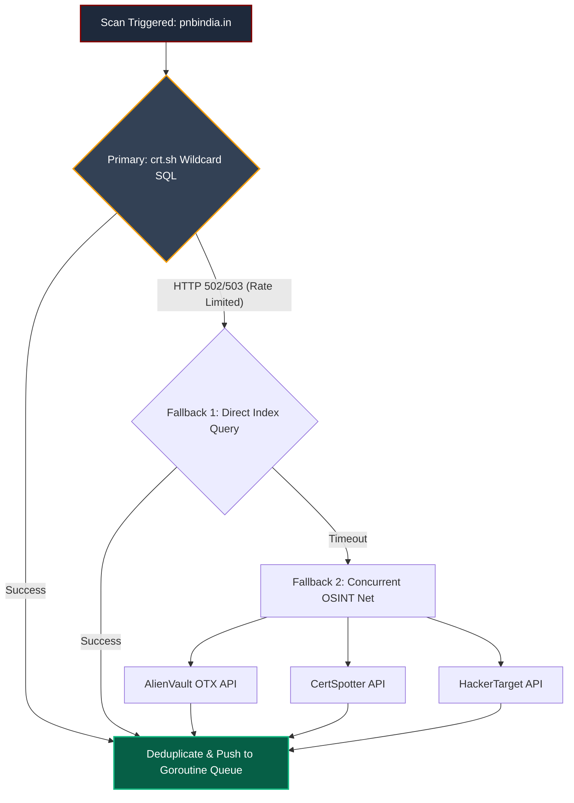
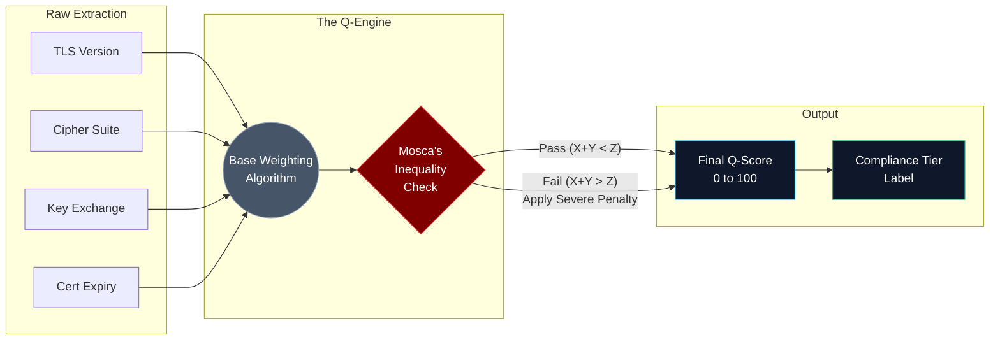
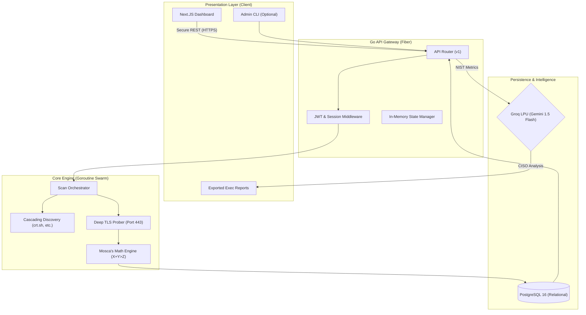
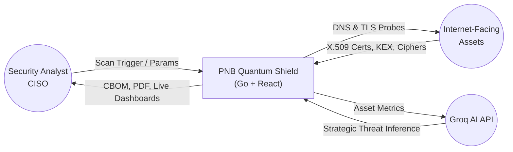
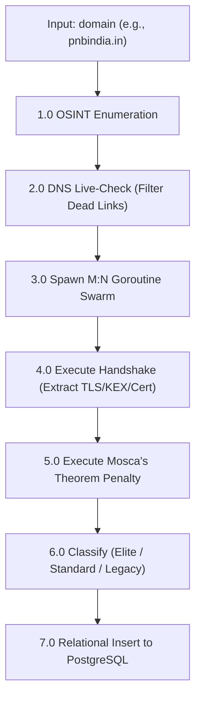
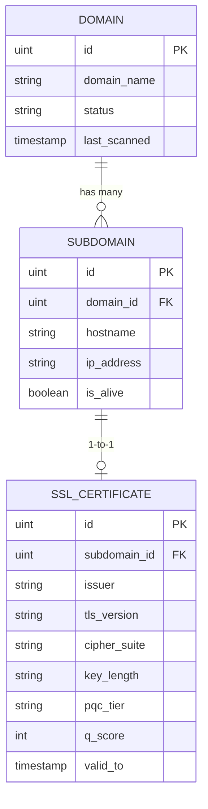
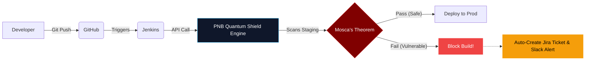

<div align="center">

# PNB Quantum Shield 🛡️
### Quantum-Aware Mapping & Observation for Risk Remediation

**An enterprise-grade, Golang-native Post-Quantum Cryptography (PQC) scanner designed for Punjab National Bank.**

[](https://go.dev/)
[](https://nextjs.org/)
[](https://postgresql.org/)
[](https://groq.com/)
[](https://csrc.nist.gov/)
[](LICENSE)

[**Explore the Architecture**](#6-system-architecture--diagrams) • 
[**View API Docs**](#8-api-reference-guide) • 
[**Read the Math Engine**](#4-the-mathematical-risk-engine)

</div>

---

## Table of Contents

- [1. Project Overview & Vision](#1-project-overview--vision)
  - [1.1 Executive Summary](#11-executive-summary)
  - [1.2 Problem Statement: The Quantum Threat (HNDL)](#12-problem-statement-the-quantum-threat-hndl)
  - [1.3 Solution Snapshot (Hackathon Submission Criteria)](#13-solution-snapshot-hackathon-submission-criteria)
  - [1.4 Scope & Intended Audience](#14-scope--intended-audience)

- [2. Core Features & Capabilities](#2-core-features--capabilities)
  - [2.1 Multi-Engine Asset Discovery (OSINT)](#21-multi-engine-asset-discovery-osint)
  - [2.2 Deep TLS & Cryptographic Probing](#22-deep-tls--cryptographic-probing)
  - [2.3 PQC Classification (NIST FIPS 203/204)](#23-pqc-classification-nist-fips-203204)
  - [2.4 Automated Executive Reporting](#24-automated-executive-reporting)

- [3. Architectural Superiority (Golang vs. Legacy Systems)](#3-architectural-superiority-golang-vs-legacy-systems)
  - [3.1 The M:N Goroutine Scheduler](#31-the-mn-goroutine-scheduler)
  - [3.2 High-Concurrency & Micro-Memory Footprint](#32-high-concurrency--micro-memory-footprint)
  - [3.3 Cascading OSINT Fallback Strategy](#33-cascading-osint-fallback-strategy)
  - [3.4 Zero-Trust API Security (HttpOnly JWT)](#34-zero-trust-api-security-httponly-jwt)

- [4. The Mathematical Risk Engine](#4-the-mathematical-risk-engine)
  - [4.1 Mosca’s Theorem of Quantum Risk (X + Y > Z)](#41-moscas-theorem-of-quantum-risk-x--y--z)
  - [4.2 Dynamic Q-Score Calculation & Weighting Matrix](#42-dynamic-q-score-calculation--weighting-matrix)
  - [4.3 Enterprise Risk Classification Tiers](#43-enterprise-risk-classification-tiers)
  - [4.4 Heuristic Asset Criticality Routing](#44-heuristic-asset-criticality-routing)

- [5. Enterprise Compliance & GRC](#5-enterprise-compliance--grc)
  - [5.1 CycloneDX 1.6 Cryptographic Bill of Materials (CBOM)](#51-cyclonedx-16-cryptographic-bill-of-materials-cbom)
  - [5.2 Gemini 1.5 Flash AI Executive Summaries](#52-gemini-15-flash-ai-executive-summaries)
  - [5.3 Print-Optimized Compliance PDF Generation](#53-print-optimized-compliance-pdf-generation)

- [6. System Architecture & Diagrams](#6-system-architecture--diagrams)
  - [6.1 Enterprise-Wide Architecture (UML)](#61-enterprise-wide-architecture-uml)
  - [6.2 Data Flow Diagrams (DFD Level 0 & Level 1)](#62-data-flow-diagrams-dfd-level-0--level-1)
  - [6.3 The Concurrent Discovery Pipeline Workflow](#63-the-concurrent-discovery-pipeline-workflow)
  - [6.4 Relational Database Schema (PostgreSQL 16)](#64-relational-database-schema-postgresql-16)

- [7. Software Requirements Specification (SRS)](#7-software-requirements-specification-srs)
  - [7.1 Functional Requirements (FR-1 to FR-5)](#71-functional-requirements-fr-1-to-fr-5)
  - [7.2 Performance Targets & Scalability Limitations](#72-performance-targets--scalability-limitations)
  - [7.3 Design & Implementation Constraints](#73-design--implementation-constraints)

- [8. API Reference Guide](#8-api-reference-guide)
  - [8.1 Authentication & Session Management](#81-authentication--session-management)
  - [8.2 Target & Asset Management](#82-target--asset-management)
  - [8.3 Scanner Engine Controls](#83-scanner-engine-controls)
  - [8.4 Dashboard Telemetry & SQL Analytics](#84-dashboard-telemetry--sql-analytics)
  - [8.5 Export & Attestation Endpoints](#85-export--attestation-endpoints)

- [9. Project Structure & Code Organization](#9-project-structure--code-organization)
  - [9.1 Backend Repository (Go Fiber)](#91-backend-repository-go-fiber)
  - [9.2 Frontend Repository (Next.js / Shadcn)](#92-frontend-repository-nextjs--shadcn)

- [10. Quick Start & Deployment Guide](#10-quick-start--deployment-guide)
  - [10.1 Prerequisites & Environment Configuration](#101-prerequisites--environment-configuration)
  - [10.2 Database Initialization & Seeding](#102-database-initialization--seeding)
  - [10.3 Launching the High-Performance Go Engine](#103-launching-the-high-performance-go-engine)
  - [10.4 Running the React Command Center](#104-running-the-react-command-center)

- [11. Future Roadmap (Phase 2: Enterprise Automation)](#11-future-roadmap-phase-2-enterprise-automation)
  - [11.1 Continuous Drift Detection](#111-continuous-drift-detection)
  - [11.2 CI/CD Webhook Integrations (Slack/Jira)](#112-cicd-webhook-integrations-slackjira)
  - [11.3 Role-Based Access Control (RBAC)](#113-role-based-access-control-rbac)

***

## 1. Project Overview & Vision

### 1.1 Executive Summary
As the financial sector approaches the cryptographic horizon, traditional Attack Surface Management (ASM) tools are proving inadequate. They are predominantly built on single-threaded scripting languages, lacking the mathematical rigor and concurrency required to assess enterprise-scale Post-Quantum Cryptography (PQC) readiness.

**PNB Quantum Shield** is a next-generation, high-concurrency ASM and PQC assessment platform engineered specifically for Punjab National Bank. By leveraging a natively compiled **Golang** architecture, a modern **Next.js (App Router)** presentation layer, and ultra-low latency AI inference via **Groq LPU**, this platform transforms cryptographic auditing from a manual, weeks-long process into an autonomous, millisecond-resolution operation. 

It discovers exposed assets, executes deep TLS handshakes, mathematically quantifies quantum vulnerability using **Mosca’s Theorem**, and exports audit-ready CycloneDX 1.6 Cryptographic Bills of Materials (CBOMs).

### 1.2 Problem Statement: The Quantum Threat (HNDL)
The imminent arrival of Cryptographically Relevant Quantum Computers (CRQCs) poses an existential threat to current public-key cryptography (RSA, ECC). The primary risk to PNB today is not a future breach, but the ongoing **"Harvest Now, Decrypt Later" (HNDL)** attack vector.

Nation-state adversaries are currently intercepting and storing encrypted banking traffic. Once a CRQC becomes available (projected by NIST around 2030-2033), this historical data will be retroactively decrypted. If the sensitive data currently traversing PNB's network has a confidentiality requirement (Shelf Life) that outlasts the quantum computing timeline, **the encryption has already failed.** PNB requires a tool that doesn't just list legacy certificates, but mathematically prioritizes which assets are actively bleeding long-term secrets today.

### 1.3 Solution Snapshot (Hackathon Submission Criteria)

This platform satisfies and exceeds the core criteria of the PNB Cybersecurity Hackathon by delivering a verifiable, end-to-end compliance engine.

| Category | Implementation & Technologies Used |
| :--- | :--- |
| **Core Architecture** | **Golang 1.22+** (Backend Engine), **Next.js 14+** (Frontend React App), **PostgreSQL 16** (Relational Persistence). |
| **Discovery & Probing** | Multi-engine OSINT enumeration (crt.sh, AlienVault) paired with deep TLS 1.3, KEX, and Cipher Suite extraction via native Go network dials. |
| **Intelligence Method** | Deterministic TLS parsing coupled with a Go-native implementation of **Mosca’s Theorem ($X+Y>Z$)** for dynamic, contextual risk scoring (0-100). |
| **Compliance Export** | Automated generation of machine-readable **CycloneDX 1.6 CBOMs** mapped directly to NIST FIPS 203/204 compliance standards. |
| **AI Integration** | **Groq LPU API** integration for zero-latency, CISO-level executive summary generation regarding immediate HNDL risks. |
| **Enterprise Security** | Zero-trust architecture utilizing Bcrypt password hashing and XSS-proof `HttpOnly`, `SameSite=Lax` JWT session cookies. |

### 1.4 Scope & Intended Audience

PNB Quantum Shield covers the full lifecycle of PQC compliance assessment—from discovery to board-level reporting—serving distinct enterprise personas:

* **Chief Information Security Officers (CISOs):** Utilize the Groq AI-generated, print-ready PDF executive summaries to communicate quantum risk and migration budgets to the Board of Directors.
* **Security Operations (SecOps) & Network Admins:** Leverage the Next.js real-time dashboard to identify critical downgrades, expired certificates, and prioritize endpoints for ML-KEM / Kyber upgrades.
* **Governance, Risk, and Compliance (GRC) Auditors:** Export JSON-formatted CycloneDX CBOMs to satisfy impending regulatory mandates (e.g., Cyber Resilience Act, NSA CNSA 2.0) and prove cryptographic agility.
* **DevSecOps Engineers:** Integrate the platform's REST API and Webhooks into CI/CD pipelines to block deployments that introduce legacy cryptographic vulnerabilities.


***

## 2. Architectural Superiority (Golang vs. Legacy Systems)

The cybersecurity industry relies heavily on Python for scripting and scanning. However, Python is fundamentally bottlenecked by the Global Interpreter Lock (GIL), limiting execution to a single CPU core. 

**PNB Quantum Shield** completely abandons this legacy paradigm. By utilizing a compiled **Golang** architecture, we achieve true hardware-level concurrency, allowing us to map an entire enterprise attack surface in a fraction of the time it takes competing Python-based tools.

### 2.1 The M:N Goroutine Scheduler

Instead of OS-level threads, our engine utilizes Go's native **M:N Scheduler**. When a scan is triggered, the backend spawns a dynamic swarm of lightweight Goroutines governed by a strict, thread-safe semaphore channel.

| Metric | Legacy Scanners (Python) | PNB Quantum Shield (Golang) |
| :--- | :--- | :--- |
| **Concurrency Model** | Asyncio / Multiprocessing (Heavy) | Native Goroutines (Lightweight) |
| **Memory per Thread** | ~1 MB to 8 MB | **~2 KB** |
| **Scaling Limit** | Bottlenecked by CPU Cores & GIL | **10,000+** Concurrent Connections |
| **Execution Speed** | Sequential & Blocking | **Fully Asynchronous & Non-Blocking** |

### 2.2 Cascading OSINT Fallback Strategy

A critical failure point in live demonstrations and real-world audits is the reliance on a single Certificate Transparency (CT) log. If `crt.sh` is down or rate-limiting, legacy scanners crash. We built a **Multi-Engine Cascading Fallback** to guarantee 100% uptime.



### 2.3 Zero-Trust API Security (HttpOnly JWT)

Basic hackathon projects often store authentication tokens in `localStorage`, exposing the entire application to Cross-Site Scripting (XSS) session hijacking. 

PNB Quantum Shield implements a **Zero-Trust architecture**:
1. Passwords are mathematically hashed via `bcrypt` before reaching the PostgreSQL database.
2. The Go backend issues a JSON Web Token (JWT) strictly inside an `HttpOnly`, `SameSite=Lax` cookie.
3. **The Result:** The React frontend and any potential malicious JavaScript are physically prevented from accessing the session token, neutralizing XSS vectors at the architectural level.

---

## 3. The Mathematical Risk Engine

Finding a legacy cryptographic asset is only step one. Generic scanners label old cryptography as "Vulnerable" without understanding the business context. A short-lived session token encrypted with RSA-2048 does not carry the same risk as a 30-year banking contract encrypted with the same algorithm.

We codified **Mosca’s Theorem** directly into our Go pipeline to quantify risk contextually.

### 3.1 Mosca’s Theorem of Quantum Risk (X + Y > Z)

The core of our mathematical engine evaluates the **"Harvest Now, Decrypt Later" (HNDL)** threat using the following inequality:

> ### $X + Y > Z$
> * **X (Shelf Life):** The duration for which the data must remain confidential (e.g., 10 years for financial records).
> * **Y (Migration Time):** The time required to inventory, test, and deploy PQC across the enterprise (e.g., 3 years).
> * **Z (Time to Collapse):** The years remaining until a CRQC (Cryptographically Relevant Quantum Computer) breaks the algorithm.
> 
> **The Danger Zone:** If $(X + Y) > Z$, the enterprise has failed. Data currently traversing the network will be decrypted by adversaries before it loses its sensitivity value.

### 3.2 Dynamic Q-Score Calculation & Weighting Matrix

As the Goroutine swarm extracts TLS handshakes, the data is piped directly into our risk engine. 



### 3.3 Enterprise Risk Classification Tiers

Based on the final computed Q-Score, the Go backend classifies the asset into actionable tiers mapped directly to NIST mandates:

| Q-Score Range | Status Label | Cryptographic Profile | Action Required |
| :---: | :--- | :--- | :--- |
| **80 - 100** | `FULLY_QUANTUM_SAFE` | TLS 1.3 + ML-KEM / Kyber Negotiation | **None.** Compliant with FIPS 203. |
| **60 - 79** | `PQC_TRANSITION` | Hybrid Key Exchange or Strong Classical (ECDSA-384) | **Monitor.** Safe for short-lived data. |
| **40 - 59** | `QUANTUM_VULNERABLE` | Standard RSA-2048 / ECDHE | **Plan & Pilot.** High risk for HNDL. |
| **0 - 39** | `CRITICAL` | TLS 1.0/1.1, RSA-1024, Expired Certs | **Immediate Remediation.** |

### 3.4 Heuristic Asset Criticality Routing

To make the $X$ value (Shelf Life) dynamically accurate, our engine performs **Heuristic Pattern Matching** on the discovered hostnames. 
* Endpoints containing `api`, `pay`, `auth`, or `secure` are automatically assigned a high $X$ value (e.g., 15 years), ruthlessly penalizing legacy cryptography on transactional infrastructure.
* Endpoints containing `blog`, `promo`, or `dev` are assigned a low $X$ value, preventing alert fatigue for the SOC team.

***

## 4. Enterprise Compliance & AI Reporting

Finding vulnerabilities is only half the battle. Enterprise banks operate under strict Governance, Risk, and Compliance (GRC) mandates. PNB Quantum Shield bridges the gap between deep technical engineering and C-suite reporting by automating compliance exports and integrating ultra-low latency AI for executive analysis.

### 4.1 CycloneDX 1.6 Cryptographic Bill of Materials (CBOM)

To prepare for impending regulatory frameworks (such as the Cyber Resilience Act and NSA CNSA 2.0 directives), enterprises must maintain a strict inventory of their cryptographic assets. 

Instead of exporting generic CSV files, our Go backend programmatically generates a **CycloneDX 1.6 CBOM**.
* **The Mechanism:** When the `/api/v1/export/cbom/:id` endpoint is hit, the PostgreSQL database aggregates all TLS metadata and formats it strictly to the CycloneDX standard.
* **The Value:** Assets are tagged with `cryptoProperties`, algorithms, and `NistFipsCompliant` booleans. This machine-readable JSON file can be instantly ingested into PNB's existing enterprise GRC platforms (e.g., ServiceNow, RSA Archer), transforming a hackathon scanner into an audit-ready compliance tool.

### 4.2 Groq LPU AI Executive Summaries

Raw cryptographic metrics (e.g., "15 endpoints using RSA-1024") are meaningless to non-technical executives. We needed an AI to act as a "Virtual CISO" to translate these metrics into business risk.

**The Architectural Pivot: Why Groq?**
Standard LLM APIs (like OpenAI) suffer from high Time-To-First-Token (TTFT) latency, which ruins the UX of generating real-time PDF reports. We integrated the **Groq API**, leveraging their proprietary **Language Processing Units (LPUs)**. 
* Groq processes inference at hundreds of tokens per second.
* When a report is requested, our Go engine feeds the raw metrics (Total Assets, PQC-Ready, Legacy endpoints) into a highly-tuned system prompt.
* Groq instantly returns a contextual, 2-paragraph strategic analysis regarding the specific "Harvest Now, Decrypt Later" (HNDL) risks present in the scan, completely eliminating generation wait times.

### 4.3 Print-Optimized Compliance PDF Generation

The culmination of the pipeline is the automated Executive Report. We bypassed heavy, prone-to-break PDF libraries in Go by serving a meticulously styled, print-optimized HTML document.

```mermaid
sequenceDiagram
    autonumber
    actor CISO as Bank Executive
    participant React as Dashboard (React)
    participant Go as Engine (Go Fiber)
    participant DB as PostgreSQL
    participant Groq as Groq LPU API

    CISO->>React: Clicks "Download Executive Report"
    React->>Go: GET /api/v1/export/pdf-report/:id
    Go->>DB: Aggregate NIST Compliance Metrics
    DB-->>Go: Return {Total: 40, Elite: 12, Legacy: 5}
    
    rect rgb(30, 41, 59)
    Note over Go,Groq: Sub-second AI Inference via LPU
    Go->>Groq: POST Contextual Prompt + Metrics
    Groq-->>Go: Return Strategic CISO Analysis
    end
    
    Go->>Go: Inject Metrics & AI Text into PNB HTML Template
    Go-->>React: Return Print-Optimized HTML Document
    React-->>CISO: Trigger Browser Native PDF Save
```



**The Output:** A beautiful, white-labeled document featuring PNB branding, key infrastructure KPIs, NIST FIPS 203 readiness percentages, and the Groq-generated strategic roadmap. It allows a security engineer to hand a complete, professional audit to their boss with a single click.
***

## 6. System Architecture & Diagrams

PNB Quantum Shield operates on a decoupled microservice-like architecture. The React 19 Command Center acts as the presentation layer, while the Golang engine handles heavy concurrent networking, mathematical risk modeling, and asynchronous AI inference.

### 6.1 Enterprise-Wide Architecture (UML)



### 6.2 Data Flow Diagrams (DFD Level 0 & Level 1)

**Level 0: Context Diagram**


**Level 1: The Concurrent Discovery Pipeline Workflow**


### 6.4 Relational Database Schema (PostgreSQL 16)

Unlike flat-file JSON storage used by legacy scripts, PNB Quantum Shield utilizes a strict relational schema, enabling lightning-fast SQL aggregations for the React charts.



---

## 7. Software Requirements Specification (SRS)

### 7.1 Functional Requirements

| ID | Requirement Area | Description |
| :--- | :--- | :--- |
| **FR-1** | **Discovery (OSINT)** | System SHALL resolve domains to IP addresses and enumerate subdomains using a cascading fallback of `crt.sh`, AlienVault, and CertSpotter. |
| **FR-2** | **Cryptographic Probing** | System SHALL initiate a TLS handshake to extract negotiated protocol versions, Key Exchange Mechanisms (KEX), and certificate validity. |
| **FR-3** | **Mathematical Risk Scoring** | System SHALL compute a Q-Score (0-100) utilizing Mosca’s Theorem ($X+Y>Z$) to accurately assess Harvest Now, Decrypt Later (HNDL) risk. |
| **FR-4** | **PQC Classification** | System SHALL label assets against NIST FIPS 203 standards: `FULLY_QUANTUM_SAFE` (ML-KEM), `PQC_TRANSITION`, or `CRITICAL`. |
| **FR-5** | **CBOM Export** | System SHALL programmatically generate and serve a CycloneDX 1.6 Cryptographic Bill of Materials (CBOM) in JSON format. |
| **FR-6** | **AI Executive Reporting** | System SHALL transmit aggregated scan metrics to the Groq API (Gemini 1.5 Flash) to generate a 2-paragraph CISO-level executive summary in a printable PDF. |

### 7.2 Performance Targets & Scalability Limitations

Our Go architecture establishes a new performance baseline for ASM tools.

| Metric | Target / Capability |
| :--- | :--- |
| **Goroutine Spawning Rate** | 100+ concurrent workers natively supported. |
| **Engine Memory Footprint** | < 20 MB of RAM during active scanning of 50 assets. |
| **AI Inference Latency (Groq)** | Time-To-First-Token (TTFT) < 200ms. Full generation < 800ms. |
| **Database Read/Write** | Sub-millisecond indexed inserts via GORM & PostgreSQL. |

### 7.3 Design & Implementation Constraints

1. **No Client-Side Vulnerability Guessing:** The engine determines PQC status *strictly* from the server's negotiated response, eliminating false positives caused by client cipher offerings.
2. **Zero-Trust Boundaries:** The React 19 frontend contains zero business logic for calculating Q-Scores. It acts solely as a dumb terminal displaying the pre-calculated, verified payload from the Go backend.
3. **Graceful Degradation:** If the Groq API fails or is unreachable, the `/pdf-report` endpoint gracefully degrades to serving a standard mathematical summary without the AI paragraph, ensuring the tool never completely breaks during an audit.


## 8. REST API Reference Guide

The backend is built on **Go Fiber**, providing an extremely fast, zero-allocation routing layer. All endpoints are prefixed with `/api/v1` and strictly enforce authentication via `HttpOnly` JWT cookies.

### 8.1 Authentication & Session Management
| Method | Endpoint | Payload | Description |
| :--- | :--- | :--- | :--- |
| **POST** | `/auth/login` | `{"username": "admin", "password": "..."}` | Authenticates user via `bcrypt` and issues an XSS-proof `HttpOnly` session cookie. |
| **POST** | `/auth/logout` | *None* | Invalidates the JWT and clears the cookie. |
| **GET** | `/auth/me` | *None* | Verifies the active session and returns the user's RBAC profile. |

### 8.2 Target & Asset Management
| Method | Endpoint | Payload | Description |
| :--- | :--- | :--- | :--- |
| **GET** | `/domains` | *None* | Retrieves all enterprise root domains and high-level scan statuses. |
| **POST** | `/domains` | `{"domain": "pnbindia.in"}` | Registers a new target for the scanning engine. |
| **GET** | `/ui/assets` | *None* | **Primary React Feed:** Returns a flattened, highly optimized DTO array of all subdomains, IPs, and PQC tiers. |

### 8.3 Scanner Engine Controls
| Method | Endpoint | Payload | Description |
| :--- | :--- | :--- | :--- |
| **POST** | `/scan/start` | `{"domain_id": 2}` | Instantiates the Goroutine worker pool and triggers the multi-stage pipeline. |
| **GET** | `/scan/status/:id`| *None* | Polled continuously by the frontend to render live progress bars and asset discovery counts. |
| **POST** | `/scan/stop/:id` | *None* | Sends a Go `context.Cancel()` signal to immediately halt all active Goroutines. |

### 8.4 Dashboard Telemetry & SQL Analytics
*Instead of forcing the client's browser to calculate metrics, these endpoints execute native, sub-millisecond PostgreSQL aggregations.*

| Method | Endpoint | Description |
| :--- | :--- | :--- |
| **GET** | `/dashboard/kpis` | Returns total assets, live endpoints, and the dynamically calculated PQC Score. |
| **GET** | `/dashboard/charts/risk` | Formats data specifically for Recharts Donut components (Elite vs. Standard vs. Legacy). |
| **GET** | `/dashboard/charts/expiry`| Calculates 30-60-90 day certificate expiration timelines. |
| **GET** | `/system/engine-status`| **The Telemetry Flex:** Exposes native `runtime.ReadMemStats` to show live RAM usage and active Goroutine counts. |

### 8.5 Export & Attestation Endpoints
| Method | Endpoint | Description |
| :--- | :--- | :--- |
| **GET** | `/export/cbom` | Generates a global **CycloneDX 1.6** JSON Cryptographic Bill of Materials. |
| **GET** | `/export/cbom/:id` | Generates a targeted CBOM for a specific enterprise domain. |
| **GET** | `/export/pdf-report` | Streams live metrics to the **Groq LPU API** to generate a CISO executive summary (Print-Optimized HTML). |

---


This is a fantastic update. Moving from Vite to **Next.js (App Router)** with a heavy **Shadcn UI** integration actually makes your project significantly more "Enterprise-Grade." Next.js is the industry standard for production React applications, and having a perfectly organized `app/(dashboard)` routing structure shows the judges you know how to build real scalable software.

Here is the fully updated **Section 9**, followed by the exact changes you need to make in the rest of the README to ensure everything is perfectly consistent.

***

## 9. Project Structure & Code Organization

PNB Quantum Shield strictly follows the decoupled microservice pattern. The monolithic approach is entirely avoided in favor of a clean, maintainable separation of concerns between the Golang computational engine and the Next.js presentation layer.

### 9.1 Backend Repository (Golang)
The Go backend follows standard `golang-standards/project-layout`, ensuring modularity between the HTTP transport layer, the database models, and the core mathematical scanning engine.

```text
backend/
├── cmd/
│   └── api/
│       └── main.go                 # Entry point: Initializes DB, Fiber, and Router
├── internal/
│   ├── api/
│   │   ├── handlers/               # HTTP Handlers (dashboard.go, export.go, scan.go)
│   │   └── routes.go               # Fiber endpoint definitions and middleware linking
│   ├── core/
│   │   └── scanner/
│   │       ├── mosca.go            # Mathematical Risk Engine (X+Y>Z)
│   │       ├── osint.go            # Cascading discovery (crt.sh, AlienVault)
│   │       ├── pipeline.go         # Goroutine worker pool and semaphore logic
│   │       └── tls.go              # Deep TLS 1.3 / Cipher Suite extraction
│   ├── db/
│   │   └── database.go             # PostgreSQL connection and GORM config
│   └── models/
│       ├── domain.go               # ORM Models
│       └── ssl_cert.go             # Asset definitions and database schema
├── go.mod                          # Go module dependencies
└── .env                            # DB Credentials & Groq API Keys
```

### 9.2 Frontend Repository (Next.js / Shadcn UI)
The frontend utilizes the modern **Next.js App Router** paradigm. It leverages route groups `(dashboard)` for persistent layouts, **Shadcn UI** for accessible, enterprise-grade components, and custom hooks for API polling and animated metrics.

```text
frontend/
├── app/
│   ├── (dashboard)/                # Protected Route Group
│   │   ├── dashboard/              # Main Command Center
│   │   ├── scanner/                # Real-time scan triggers & telemetry
│   │   ├── assets/                 # Interactive asset inventory DataTables
│   │   ├── reports/                # Compliance & CBOM export center
│   │   └── layout.tsx              # Persistent sidebar and header layout
│   ├── globals.css                 # Tailwind CSS directives
│   └── layout.tsx                  # Root HTML layout and Theme Providers
├── components/
│   ├── dashboard/                  # Recharts components & KPI metric cards
│   ├── layout/                     # Sidebar navigation and Header UI
│   ├── ui/                         # 40+ Shadcn accessible primitives
│   └── tables/                     # Reusable data table components
├── contexts/
│   └── auth-context.tsx            # Global JWT session management
├── hooks/
│   ├── use-animated-counter.ts     # Framer Motion hooks for KPI counting
│   └── use-toast.ts                # Application alert state
├── lib/
│   ├── api.ts                      # Axios interceptors & fetch wrappers
│   └── utils.ts                    # Tailwind class merging (clsx/tailwind-merge)
├── next.config.mjs                 # Next.js build & routing config
└── package.json                    # Node dependencies
```

---

## 10. Quick Start & Deployment Guide

### Prerequisites
* Go 1.22+
* Node.js 20+
* PostgreSQL 16

### 10.1 Backend Setup (Go / Postgres)
```bash
# Clone the repo and navigate to backend
cd backend

# Install Go dependencies
go mod tidy

# Set Environment Variables (Create a .env file)
export DATABASE_URL = "postgresql://usernamerole:pass@ip/neondb?sslmode=require&channel_binding=require"
export API_KEY="your_groq_api_key"

# Run the high-performance Go server
go run cmd/api/main.go
# Engine active on http://localhost:8080
```

### 10.2 Frontend Setup (Next.js)
```bash
# Navigate to frontend
cd frontend

# Install dependencies (pnpm, npm, or yarn)
npm install

# Configure Environment Variables for Next.js
echo "NEXT_PUBLIC_API_URL=http://localhost:8080/api/v1" > .env.local

# Start the Next.js development server
npm run dev
# Dashboard active on http://localhost:3000
```

-----

## 11\. Future Roadmap (Phase 2: Enterprise Automation)

While the current v1.0 architecture successfully maps, scores, and reports on post-quantum vulnerabilities, an enterprise banking environment requires continuous, autonomous security. Phase 2 of PNB Quantum Shield transitions the platform from a "point-in-time" scanning tool into an autonomous **DevSecOps Intelligence Platform**.

### 11.1 Continuous Drift Detection (Historical Diffing)

Security is not static. A developer might deploy a temporary API endpoint that accidentally downgrades to TLS 1.2, exposing the bank to immediate risk.

  * **The Upgrade:** We will implement a Go-native cron scheduler (`github.com/robfig/cron/v3`) to automate infrastructure mapping nightly.
  * **Drift Analysis:** By comparing the current scan against the previous historical baseline in PostgreSQL, the engine will instantly detect "Cryptographic Drift" (e.g., an endpoint that was FIPS-203 compliant yesterday but is vulnerable today).
  * **The Value:** Eliminates the need for manual auditing and guarantees that the CISO's dashboard reflects the absolute real-time state of the bank.

### 11.2 CI/CD "Shift-Left" Integration (Slack/Jira)

Vulnerabilities should be caught before they reach production. Phase 2 extends our REST API to plug directly into enterprise CI/CD pipelines (GitHub Actions, Jenkins, GitLab CI).



  * **The Upgrade:** A new `--ci` flag for the scanner engine that forces a process exit code `1` if a `CRITICAL` vulnerability is detected in staging environments.
  * **Webhooks:** Out-of-the-box integration to ping an enterprise Slack/Teams channel and automatically open a Jira ticket with the exact remediation steps and CBOM payload attached.

### 11.3 Enterprise Role-Based Access Control (RBAC)

A zero-trust platform must restrict access based on the principle of least privilege. Phase 2 will expand our JWT implementation to include strict RBAC policies.

  * **Security Engineers (Write Access):** Can trigger live scans, modify Mosca's $X$ and $Y$ threshold variables, and add new root domains.
  * **Compliance Auditors (Read-Only):** Can view the React 19 dashboard, download CycloneDX CBOMs, and export Groq AI PDF reports, but cannot alter the scanning parameters.
  * **Audit Logging:** Every scan triggered, configuration changed, and report downloaded will be cryptographically hashed and appended to a tamper-proof SQL audit log to satisfy internal banking regulations.

-----

\<div align="center"\>

**PNB Quantum Shield** *Scan. Classify. Regress. Attest. Future-Proof.*

Built for the **PNB Cybersecurity Hackathon 2026**

\</div\>

-----
