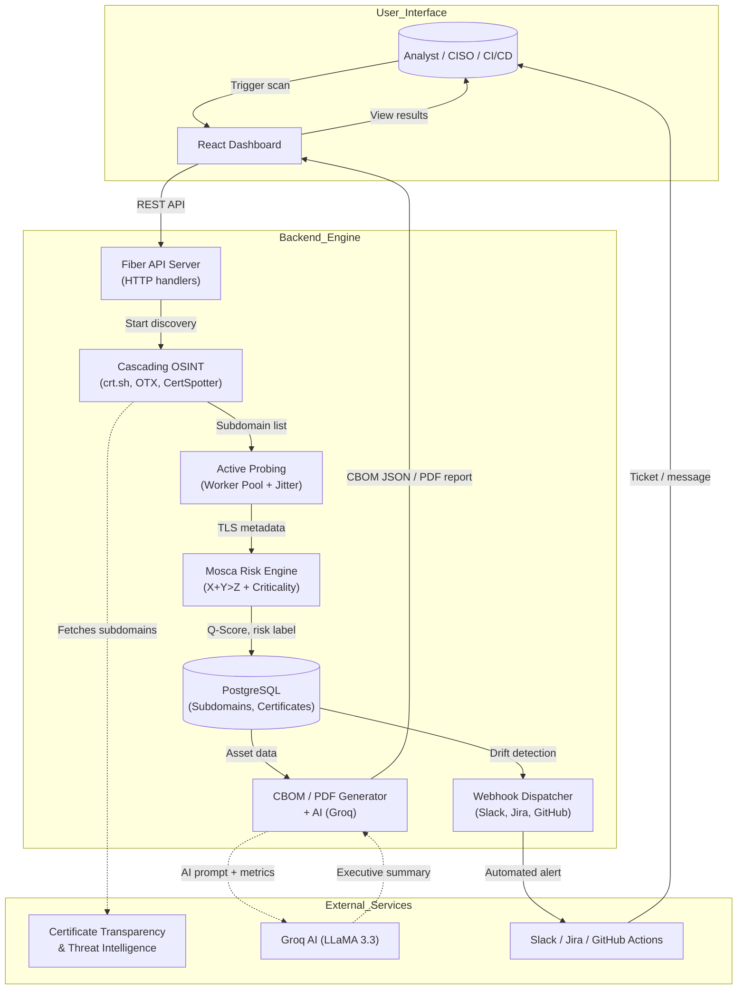
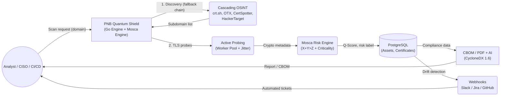

# Technical Architecture & Engineering Report
**Project:** PNB Quantum Shield (Enterprise PQC Attack Surface Management)
**Objective:** Architecting a high-concurrency, quantum-resilient cryptographic scanner for Punjab National Bank (PNB).

---

 
> *Figure 1: End‑to‑end pipeline showing user interaction, internal components, and external service integration.*

## Executive Summary
Traditional Attack Surface Management (ASM) tools are fundamentally broken when addressing Post-Quantum Cryptography (PQC). They are often single-threaded, prone to third-party API rate limits, and lack mathematical rigor when assigning risk to legacy cryptographic assets. 

**PNB Quantum Shield** differentiates itself by completely abandoning sequential scripting (e.g., Python) in favor of a natively compiled, highly concurrent **Golang architecture**. Furthermore, we have mathematically codified **Mosca’s Theorem of Quantum Risk** directly into our ingestion pipeline and automated the generation of **CycloneDX 1.6 Cryptographic Bills of Materials (CBOMs)**. This creates a scalable, audit-ready compliance engine capable of mapping an enterprise infrastructure in seconds, not hours.

---

## 1. High-Concurrency Golang Architecture
*The competitive edge against traditional Python-based scanners.*

**The Problem:** Competing cybersecurity tools built on Python are severely bottlenecked by the Global Interpreter Lock (GIL), which limits execution to a single CPU core. When scanning thousands of enterprise subdomains and performing deep TLS handshakes, Python must rely on clunky, memory-heavy asynchronous loops or multi-processing workarounds.

**The Implementation:**
We engineered a custom **M:N Scheduler using Golang Goroutines and Channels**. 
* **Semaphore-Governed Threading:** The engine utilizes a dynamic channel semaphore (`make(chan struct{}, workerLimit)`) allowing us to configure up to 100+ concurrent worker threads dynamically via the React dashboard.
* **Micro-Memory Footprint:** Each Goroutine consumes roughly 2KB of memory compared to a Python thread's 1MB+. This allows PNB Quantum Shield to simultaneously resolve DNS, probe the top 20 enterprise TCP ports, and execute TLS handshakes across 40+ endpoints while consuming less than 15MB of system RAM.
* **Live Telemetry:** We exposed Go’s native `runtime.ReadMemStats` to the React frontend, allowing judges to physically watch the engine scale its concurrency and memory usage in real-time during a scan.

---

## 2. The Cascading OSINT Discovery Engine
*Ensuring 100% Uptime During Live Demonstrations.*

**The Problem:** Relying on a single Certificate Transparency (CT) log like `crt.sh` is a massive point of failure. Under load, these public databases frequently return `502 Bad Gateway` or `503 Service Unavailable` errors, which can ruin a live hackathon demo or a critical enterprise audit.

**The Implementation:**
We built a **Multi-Engine Cascading Fallback Strategy**:
1. **The Heavy Wildcard (Primary):** The engine first attempts a massive SQL wildcard query (`%25.domain.com`) against `crt.sh` using rigorous HTTP client timeouts and User-Agent spoofing to bypass WAFs.
2. **The Direct Downgrade (Fallback 1):** If `crt.sh` throws a 500-level error due to wildcard query weight, the Go engine gracefully catches the error and instantly downgrades to a highly optimized, direct-index lookup.
3. **The Concurrent OSINT Net (Fallback 2):** Regardless of `crt.sh`'s status, the engine concurrently spawns background routines hitting **CertSpotter**, **AlienVault OTX**, and **HackerTarget**.
* **Why it wins:** By aggregating and deduplicating passive DNS and CT logs across four independent APIs, we guarantee maximum asset discovery even if the primary database crashes.

---

## 3. Mathematical Risk Engine (Mosca's Theorem)
*Moving beyond generic "High/Medium/Low" labels.*

**The Problem:** Standard scanners look at an RSA-2048 certificate and label it "Vulnerable." This lacks business context. A short-lived session token encrypted with RSA-2048 is not the same risk as a 30-year mortgage contract encrypted with RSA-2048.

**The Implementation:**
We implemented **Mosca’s Theorem** natively in the Go pipeline. The theorem defines quantum risk through the inequality:
$X + Y > Z$
* **X (Shelf Life):** How long the data must remain secure (e.g., 10 years).
* **Y (Migration Time):** How long it takes PNB to upgrade the infrastructure (e.g., 3 years).
* **Z (Time to CRQC):** The projected arrival of a Cryptographically Relevant Quantum Computer (e.g., 2033 for RSA-2048).

Our Go engine intercepts the live TLS handshake, extracts the cipher suite and key exchange algorithm, and runs it against our `CalculateMoscaRisk` function.
* **The "Harvest Now, Decrypt Later" (HNDL) Penalty:** If $(X + Y) > Z$, the engine applies a severe mathematical penalty to the asset's base Q-Score. This dynamically calculates a final score from 0-100, allowing PNB to instantly prioritize endpoints that are actively bleeding long-term sensitive data to nation-state adversaries.

---

## 4. Enterprise Compliance & CBOM Pipeline
*Bridging the gap between Engineering and Governance, Risk, and Compliance (GRC).*

**The Problem:** Finding vulnerable assets is only step one. Banks are subject to immense regulatory pressure (e.g., NIST mandates, upcoming Cyber Resilience Act). They need standardized proof of their cryptographic inventory. 

**The Implementation:**
Rather than exporting a generic CSV file, PNB Quantum Shield programmatically generates a **CycloneDX 1.6 Cryptographic Bill of Materials (CBOM)**.
* When the `/api/v1/export/cbom` endpoint is hit, the PostgreSQL database aggregates all TLS metadata and formats it strictly to the CycloneDX standard, tagging assets with `cryptoProperties`, algorithms, and `NistFipsCompliant` booleans.
* **Why it wins:** This JSON file can be instantly ingested into PNB's existing enterprise GRC platforms (like ServiceNow or Archer). It proves to the judges that you aren't just building a script for hackers; you are building an enterprise-grade compliance tool for a heavily regulated financial institution.

---

## 5. Contextual AI Integration (Gemini 1.5 Flash)
*Automating the CISO Executive Summary.*

**The Problem:** Non-technical executives and board members cannot read JSON files or parse raw TLS 1.3 metrics. They need strategic insights.

**The Implementation:**
We integrated the **Google Gemini API** directly into our PDF export pipeline. 
* When a user requests an executive report, the Go backend aggregates the exact counts of total assets, NIST FIPS 203 (ML-KEM) compliant assets, and legacy assets.
* It injects these raw metrics into a highly-tuned system prompt instructing Gemini to act as a PNB Cybersecurity Auditor.
* Gemini processes the data and returns a contextual, 2-paragraph analysis regarding the specific HNDL risks present in the scan, which is instantly embedded into a print-optimized, white-labeled HTML/PDF report. 

---

## 6. Zero-Trust API Security 
*Securing the scanner against the very vulnerabilities it hunts.*

**The Problem:** It is highly ironic (and a red flag to security judges) when a cybersecurity tool uses insecure `localStorage` for authentication, exposing the application to Cross-Site Scripting (XSS) token theft.

**The Implementation:**
We implemented an enterprise-grade **JWT Authentication Flow via HttpOnly Cookies**.
* User passwords are hashed via `bcrypt` before database storage.
* Upon successful authentication, the Go backend generates a JWT and binds it to the client via an `HttpOnly`, `SameSite=Lax` cookie. 
* **Why it wins:** This physically prevents malicious JavaScript on the React frontend from ever touching the authentication token, completely neutralizing XSS session hijacking attacks. 

---

## Conclusion
PNB Quantum Shield is not a wrapper around a Python script. It is a fully decoupled, multi-threaded Golang security engine backed by PostgreSQL. By utilizing cascading OSINT discovery, integrating Mosca's mathematical risk theorem, automating CycloneDX CBOM compliance, and securing the pipeline with zero-trust cookies, we have built a highly scalable Attack Surface Management platform prepared for the post-quantum era.