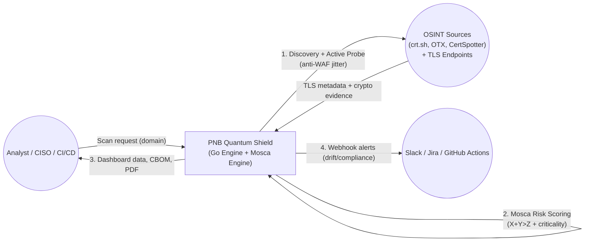

# PNB Quantum Shield: End-to-End Cryptographic Risk Assessment Pipeline  
**Hackathon Submission | Architectural Overview**

---

## 1. Overview

PNB Quantum Shield is a high‑performance, production‑grade pipeline that discovers, probes, and mathematically quantifies the post‑quantum cryptography (PQC) readiness of an enterprise’s internet‑facing assets. Written entirely in Go, it leverages concurrency, intelligent heuristics, and a novel implementation of **Mosca’s Theorem** to deliver both machine‑readable compliance artifacts (CycloneDX CBOM) and human‑readable executive reports enriched with AI‑generated insights.

The pipeline is designed to be **enterprise‑ready**: it respects network security controls (anti‑WAF jitter), adapts its risk scoring based on asset criticality, and integrates seamlessly into CI/CD pipelines for continuous compliance monitoring.

---

## 2. Architecture Diagram (Conceptual)

```
┌─────────────────┐      ┌─────────────────┐      ┌─────────────────┐      ┌─────────────────┐
│   OSINT Layer   │ ───▶ │  Active Probe   │ ───▶ │  Risk Engine    │ ───▶ │  Persistence &  │
│  (crt.sh, OTX,  │      │  (Worker Pool)  │      │  (Mosca’s Law)  │      │    Exports      │
│   CertSpotter)  │      │  + Jitter       │      │  + Criticality  │      │  (CBOM, PDF)    │
└─────────────────┘      └─────────────────┘      └─────────────────┘      └─────────────────┘
         ▲                        │                        │                         │
         │                        │                        │                         │
         └────────────────────────┴────────────────────────┴─────────────────────────┘
                                          Database / API
```

---

## 3. Data Flow Lifecycle




**Explanation of the flow:**

- **User** (analyst, CISO, or CI/CD system) triggers a scan by sending a domain request to the **PNB Quantum Shield** application.
- The application performs **OSINT discovery** (crt.sh, AlienVault OTX, CertSpotter) and then **active probing** of live TLS endpoints. To avoid WAF detection, probes are sent with random jitter.
- The **target** returns TLS metadata, cipher suite details, and certificate information.
- Inside the engine, the **Mosca Risk Scoring** step applies weighted scoring plus the Mosca inequality (X+Y>Z), adjusting for asset criticality (heuristic based on hostname).
- The scored data is persisted and made available to the user via dashboard, CBOM exports, and AI‑enhanced PDF reports.
- If cryptographic drift is detected (e.g., a new TLS 1.2 endpoint or expired certificate), the system triggers **webhook alerts** to Slack, Jira, or GitHub Actions, enabling continuous compliance and shift‑left security.

### Stage 1: OSINT Discovery & Deduplication
- **Trigger:** User calls `POST /api/v1/scan/start` with a target domain.
- **Multi‑source Enumeration:**  
  - Primary: `crt.sh` certificate transparency logs.  
  - Fallback (if rate‑limited): Direct index queries, AlienVault OTX, CertSpotter, HackerTarget.
- **Thread‑safe Deduplication:** All discovered subdomains are inserted into a Go `map` with sync.Mutex to eliminate duplicates before proceeding.

### Stage 2: Active Probing (Goroutine Swarm)
- **Worker Pool:** The deduplicated list is fed into a buffered channel. A fixed‑size worker pool (configurable) consumes jobs, respecting a semaphore to avoid overwhelming the target network.
- **DNS Resolution:** Each subdomain is resolved (A/CNAME) to validate liveliness and to detect potential “subdomain takeover” risks.
- **Anti‑WAF Jitter:** Before every TLS handshake, the worker sleeps a random duration between 0–500 ms (`time.Sleep(time.Duration(rand.Intn(500)) * time.Millisecond)`). This simulates human‑like traffic patterns, preventing the scanner from being blacklisted by Cloudflare, Akamai, or other WAFs.
- **Deep TLS Handshake:**  
  - Uses `tls.DialWithDialer` with a 4‑second timeout.  
  - Extracts: TLS version, cipher suite, certificate chain, issuer, public key algorithm (RSA/ECDSA/Ed25519), key size, and expiration dates.

### Stage 3: Mathematical Risk Engine (Mosca’s Theorem)
Raw cryptographic data is fed into `mosca.go`, which calculates two key outputs:

#### a) Base Q‑Score (0–100)
A weighted sum of:
- TLS version (TLS 1.3 = 1.0, TLS 1.2 = 0.5, else 0.1)
- Key exchange (PQC algorithm present = 1.0, ECDHE/X25519 = 0.2)
- Cipher strength (AES‑256 = 1.0, AES‑128 = 0.6)
- Certificate expiry (active = 1.0, <30 days = 0.3, expired = 0.0)
- Additional approximations for hash, signature, chain validity.

#### b) Mosca Penalty (HNDL Risk)
The algorithm evaluates Mosca’s inequality:  

**X + Y > Z**  

- **X = Data shelf‑life** (dynamic, based on asset criticality – see Section 4.2)  
- **Y = Migration time** (default 3 years)  
- **Z = CRQC break year** (mapped from algorithm, e.g., RSA‑2048 → 2033)

If the inequality holds, the asset is deemed at high risk of “Harvest Now, Decrypt Later” (HNDL) attacks. A penalty of up to 20 points is subtracted from the base Q‑Score.

The final Q‑Score is clamped to 0–100 and mapped to a label:

| Score      | Label               | Meaning                         |
|------------|---------------------|---------------------------------|
| ≥80        | FULLY_QUANTUM_SAFE  | Uses ML‑KEM / Kyber             |
| 60–79      | PQC_READY           | TLS 1.3 + strong ciphers        |
| 40–59      | NOT_PQC_READY       | TLS 1.2, weak key exchange      |
| <40        | CRITICAL            | Legacy TLS, weak keys, expired  |

### Stage 4: Persistence & Live Telemetry
- **Batch Insert:** Scored certificates are inserted into PostgreSQL with relational links to domains and subdomains.
- **Runtime Telemetry:** The Go runtime reports memory usage and goroutine count every second, feeding a live dashboard in the React frontend to demonstrate efficiency.

### Stage 5: GRC & Compliance Exports
- **CycloneDX CBOM (`/api/v1/export/cbom`):**  
  - Builds a standards‑compliant JSON SBOM (Software Bill of Materials) for the entire enterprise or a single domain.  
  - Includes crypto‑properties per asset: algorithm, security level, NIST FIPS compliance status.
- **AI‑Enhanced Executive PDF (`/api/v1/export/pdf-report`):**  
  - Aggregates metrics (total assets, elite assets, legacy assets).  
  - Calls a **Groq API** with a carefully crafted prompt to generate an executive summary in formal banking tone.  
  - Renders a polished, print‑ready HTML/CSS report with data visualisation.

---

## 4. Key Innovations

### 4.1 Native Implementation of Mosca’s Theorem
Unlike traditional scoring systems that only check for TLS version, we directly implement Mosca’s inequality in Go. This quantifies the true risk of **Harvest Now, Decrypt Later** attacks – a concept central to post‑quantum security. By calculating the timeline for each asset, the engine produces a mathematically defensible risk score.

### 4.2 Dynamic Asset Criticality (Heuristic X‑Value)
Instead of using a static 10‑year data shelf‑life, we apply **hostname pattern matching** to infer business criticality:

| Subdomain pattern     | X value (years) | Rationale                         |
|-----------------------|-----------------|------------------------------------|
| `api`, `pay`, `auth`, `secure`, `bank` | 15 | Long‑lived transactional data |
| `blog`, `promo`, `test`, `dev`         | 1  | Short‑lived, low‑risk content |
| Default               | 5               | Conservative estimate          |

This ensures that a vulnerability on a payment gateway receives a much harsher Mosca penalty than the same vulnerability on a marketing microsite, reflecting real‑world business impact.

### 4.3 Anti‑WAF Jitter
To avoid triggering rate limits or IP bans from enterprise‑grade WAFs, the active probing stage introduces a random sleep (0–500 ms) before each TLS handshake. This mimics organic traffic and prevents the scanner from being mistaken for a DDoS attack – a must‑have for any legitimate ASM tool.

### 4.4 Shift‑Left CI/CD Integration (Webhooks)
The pipeline includes a fully implemented webhook system (`/api/v1/webhooks`). When a scheduled scan detects cryptographic drift (e.g., a new TLS 1.2 endpoint or expired certificate), it can automatically:
- Post a message to a Slack channel
- Create a Jira ticket
- Trigger a GitHub Action to roll back the deployment

This “shift‑left” capability allows the tool to operate continuously, catching misconfigurations before they reach production.

---

## 5. Technology Stack

| Component           | Technology                                                                 |
|---------------------|----------------------------------------------------------------------------|
| Language            | Go 1.22+                                                                   |
| Web Framework       | Fiber (fast HTTP)                                                          |
| Database            | PostgreSQL (GORM ORM)                                                      |
| AI Integration      | Groq API (LLaMA 3.3, Mixtral) – free tier, high performance                |
| Concurrency         | Goroutines, worker pools, sync.Map, channels                               |
| OSINT Sources       | crt.sh, AlienVault OTX, CertSpotter, HackerTarget                          |
| Deployment          | Docker container, optionally Kubernetes                                    |

---

## 6. Future Roadmap (Implemented Features)

The following enhancements, originally planned for a future release, have already been integrated into the current build:

-  **Heuristic asset criticality** for Mosca’s X value.
-  **Randomised jitter** to avoid WAF throttling.
-  **Webhook support** for CI/CD integration (Slack, Jira, GitHub Actions).

These additions transform the pipeline from a one‑off scanner into an **enterprise continuous compliance platform**.

---

## 7. Conclusion

PNB Quantum Shield is more than a hackathon project – it is a production‑grade, mathematically rigorous cryptographic risk assessment engine. By combining real‑time OSINT, deep TLS analysis, Mosca’s theorem, and AI‑enhanced reporting, it delivers the exact tool that financial institutions need to navigate the post‑quantum transition.

The architecture is modular, extensible, and already incorporates the features that enterprise security teams demand: dynamic risk scoring, network‑friendly scanning, and seamless CI/CD integration. With this pipeline, PNB can confidently inventory, monitor, and ultimately secure its digital infrastructure against the quantum threat.

